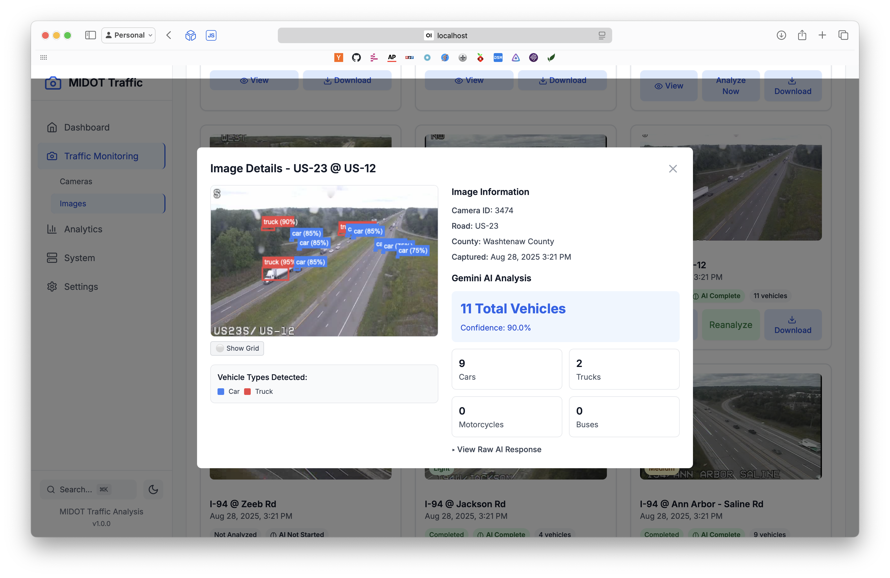

# MIDOT Traffic Dashboard - Camera Analysis System

A comprehensive traffic camera monitoring and analysis system for Michigan Department of Transportation (MIDOT) cameras. The system automatically fetches camera data, downloads images, and tracks changes using hash comparison.



## Features

- **Real-time Traffic Monitoring**: Live camera feeds from major Michigan highways
- **AI-Powered Vehicle Detection**: Advanced computer vision analysis using Google Gemini AI
- **Traffic Analytics Dashboard**: Comprehensive traffic flow analysis and reporting
- **Historical Data Tracking**: Long-term traffic pattern analysis and trend identification
- **Automated Image Processing**: Continuous monitoring with automated analysis
- **Advanced Vehicle Classification**: Detection of cars, trucks, motorcycles, buses, and more
- **Bounding Box Visualization**: Precise vehicle location mapping with confidence scores
- **Enhanced Safety & Configuration**: Comprehensive safety settings, rate limiting, and error handling
- **Performance Optimization**: Configurable batch processing and concurrency controls
- **Configurable Data Aggregation**: Adjustable time intervals for vehicle count charts (1-60 minutes, default: 10 minutes)

## Tech Stack

### Backend

- **Node.js** with Express.js
- **SQLite** database
- **Google Gemini AI** for vehicle detection and analysis
- **node-cron** for scheduled tasks
- **axios** for HTTP requests
- **crypto** for image hashing

### Frontend

- **React 18** with hooks
- **Vite** for fast development and building
- **Tailwind CSS** for styling
- **React Router** for navigation
- **Lucide React** for icons
- **Axios** for API communication

## Prerequisites

- Node.js 18+
- npm or yarn

## Installation

### 1. Clone the repository

```bash
git clone <repository-url>
cd midot-traffic
```

### 2. Install dependencies

```bash
# Install backend dependencies
npm install

# Install frontend dependencies
cd client
npm install
cd ..
```

### 3. Database Setup

The application uses SQLite which is automatically configured. The database file will be created at `server/storage/midot_traffic.db` on first run.

No additional database setup is required.

### 4. Environment Variables (Optional)

Create a `.env` file in the root directory:
```bash
# Database Configuration (Optional)
DB_USER=postgres
DB_HOST=localhost
DB_NAME=midot_traffic
DB_PASSWORD=your_password
DB_PORT=5432
PORT=3001

# Gemini AI Configuration (Required for vehicle detection)
GEMINI_API_KEY=your_gemini_api_key_here
GEMINI_MODEL=gemini-2.0-flash
GEMINI_USE_BATCH_MODE=true
GEMINI_BATCH_SIZE=10
GEMINI_CONFIDENCE_THRESHOLD=0.7
```

## Configuration

### Vehicle Count Aggregation Interval

The system allows you to configure the time interval used for grouping vehicle count data in charts and analytics. This setting affects how traffic data is aggregated and displayed.

**Default Value**: 10 minutes (600,000 milliseconds)

**Available Options**: 1, 2, 5, 10, 15, 30, or 60 minutes

**Configuration Methods**:

1. **Runtime Configuration** (Recommended):
   - Navigate to Settings → Configuration in the web interface
   - Use the "Vehicle Count Aggregation Interval" dropdown
   - Click "Update Interval" to apply changes

2. **Configuration File**:
   - Edit `server/config/runtime.json`
   - Modify the `analytics.vehicleCountAggregationInterval` value
   - Restart the server

3. **Environment Variable**:

   ```bash
   VEHICLE_COUNT_AGGREGATION_INTERVAL=300000  # 5 minutes
   ```

**Note**: Changes take effect immediately for new chart data. Existing charts may need to be refreshed to reflect the new interval.

## Usage

### Development Mode

```bash
# Start both backend and frontend in development mode
npm run dev

# Or start them separately:
npm run server:dev    # Backend on port 3001
npm run client:dev    # Frontend on port 3000
```

### Production Mode

```bash
# Build the frontend
npm run build

# Start the production server
npm start
```

### Database Operations

```bash
# The database is automatically initialized on startup
# No manual setup required
```

## API Endpoints

### Cameras

- `GET /api/cameras` - List all cameras
- `GET /api/cameras/:id` - Get specific camera details
- `POST /api/cameras/refresh` - Refresh camera data from MIDOT
- `GET /api/cameras/stats/summary` - Camera statistics

### Images

- `GET /api/images/recent` - Recent images across all cameras
- `GET /api/images/camera/:cameraId` - Images for specific camera
- `GET /api/images/comparison/:cameraId` - Image change analysis
- `GET /api/images/stats/summary` - Image statistics
- `GET /api/images/file/:filename` - Serve local image files

## System Architecture

### Backend Services

- **Camera Service**: Handles MIDOT API communication and camera data management
- **Image Service**: Manages image downloads, storage, and hash comparison
- **Database Service**: Handles all database operations and table creation

### Scheduled Tasks

- **Camera Updates**: Fetches new camera data every minute
- **AI Analytics**: Processes queued images in batches every 5 minutes

### Data Flow

1. System fetches camera list from MIDOT API
2. For each camera, downloads current image
3. Generates MD5 hash of new image
4. Compares with previous image hash
5. Stores image and metadata in database
6. Updates change tracking information

## Database Schema

The application uses SQLite with the following main tables:

### Cameras Table

- `id`: Primary key
- `camera_id`: Unique camera identifier
- `name`: Camera name/description
- `latitude/longitude`: GPS coordinates
- `road_name`: Associated road
- `county`: County location
- `direction`: Traffic direction
- `enabled`: Camera status
- `ai_analysis_enabled`: AI analysis status
- `created_at/updated_at`: Timestamps

### Images Table

- `id`: Primary key
- `camera_id`: Foreign key to cameras
- `image_url`: Original image URL
- `local_path`: Local file path
- `image_hash`: MD5 hash of current image
- `previous_hash`: MD5 hash of previous image
- `has_changed`: Boolean flag for changes
- `captured_at/created_at`: Timestamps

### Vehicle Detections Table

- `id`: Primary key
- `image_id`: Foreign key to images
- `camera_id`: Foreign key to cameras
- `total_vehicles`: Total vehicle count
- `cars`, `trucks`, `motorcycles`, etc.: Vehicle type counts
- `confidence_score`: AI detection confidence
- `processing_status`: Analysis status
- `created_at`: Timestamp

## Configuration

### Update Frequency

The system can be configured to update camera images at different intervals:
- 1 minute (default for image capture)
- 5 minutes (default for AI analytics batch processing)
- 15 minutes
- 30 minutes

### Image Retention

Configure how long to keep images in storage (default: 30 days)

### Features

- Enable/disable automatic image cleanup
- Enable/disable hash comparison
- Database maintenance options

## Monitoring & Analytics

### Dashboard

- Total camera count
- Daily image count
- Change rate percentage
- County and road statistics

### Camera Details

- Individual camera information
- Recent image history
- Change analysis over time
- Location and metadata

### System Status

- Database connectivity
- Update schedule status
- Storage status
- Performance metrics

## Troubleshooting

### Common Issues

1. **Database Connection Failed**
   - Check PostgreSQL service is running
   - Verify connection credentials
   - Ensure database exists

2. **MIDOT API Errors**
   - Check internet connectivity
   - Verify API endpoints are accessible
   - Check for rate limiting

3. **Image Download Failures**
   - Verify storage directory permissions
   - Check available disk space
   - Review network connectivity

### Logs

Check console output for detailed error messages and system status updates.

## Contributing

1. Fork the repository
2. Create a feature branch
3. Make your changes
4. Add tests if applicable
5. Submit a pull request

## License

MIT License - see LICENSE file for details

## Support

For issues and questions:

- Check the troubleshooting section
- Review the API documentation
- Open an issue on GitHub

## Roadmap

- [ ] Real-time image streaming
- [ ] Advanced image analysis (traffic pattern detection)
- [ ] Alert system for significant changes
- [ ] Mobile app
- [ ] API rate limiting and caching
- [ ] Docker containerization
- [ ] Kubernetes deployment
- [ ] Multi-region support
